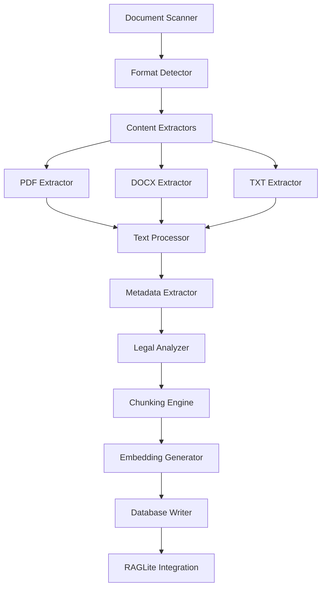

# 📄 Document Processing Pipeline Implementation Plan

## 🎯 Executive Summary

This document outlines the comprehensive implementation plan for a document processing pipeline that will integrate with the existing RAGLite system to automatically process, extract, and index legal documents from the divorce case management system. The pipeline will handle multiple document formats, extract legal-specific metadata, and optimize content for intelligent search and retrieval.

---

## 📊 Current State Assessment

### ✅ **Existing Infrastructure**
- **RAGLite Integration**: Fully operational with PostgreSQL and pgvector
- **Database Schema**: Complete with documents, chunks, embeddings, and search queries tables
- **Vector Search**: Hybrid search combining keyword and vector similarity working
- **Document Tools**: PDF2MD-HTTP tool available for PDF processing
- **Case Document Structure**: Well-organized folder hierarchy with legal document categories

### 📁 **Document Landscape Analysis**
```
Case_Documents/
├── 01_Legal_Documents/      # Primary legal filings and pleadings
├── 02_Financial_Documents/  # Financial statements and records
├── 03_Evidence_Communications/ # Correspondence and evidence
├── 04_Child_Related/        # Child custody and support documents
├── 05_Property_Assets/      # Property and asset documentation
├── 06_Support_Calculations/ # Alimony and support calculations
├── 07_Mediation_Records/    # Mediation session records
├── 08_Administrative/       # Administrative and procedural docs
├── 09_Archive/             # Archived documents
└── 10_Laws/                # Legal references and statutes
```

### 🔍 **Identified Document Types**
- **PDF Files**: Court filings, official documents, scanned records
- **DOCX Files**: Legal pleadings, declarations, inventories
- **TXT Files**: Plain text communications and notes
- **Mixed Languages**: French and English legal documents
- **Structured Content**: Legal formatting with headers, sections, dates

---

## 🎯 Requirements Analysis

### 🔧 **Functional Requirements**

#### **1. Multi-Format Document Processing**
- **PDF Processing**: Extract text from native and scanned PDFs
- **DOCX Processing**: Extract structured content from Word documents
- **TXT Processing**: Process plain text files
- **Format Detection**: Automatic file type identification
- **Encoding Handling**: Support for UTF-8, Latin-1, and other encodings

#### **2. Legal Document Intelligence**
- **Metadata Extraction**: Case numbers, filing dates, party names, document types
- **Legal Structure Recognition**: Headers, sections, clauses, signatures
- **Date Extraction**: Filing dates, hearing dates, deadlines
- **Party Identification**: Plaintiff, defendant, lawyers, judges
- **Document Classification**: Pleadings, motions, orders, evidence, correspondence

#### **3. Content Optimization**
- **Legal Chunking**: Preserve legal context and structure
- **Section Preservation**: Maintain document hierarchy
- **Citation Handling**: Preserve legal citations and references
- **Language Detection**: French/English content identification
- **Text Cleaning**: Remove formatting artifacts, normalize text

#### **4. Batch Processing Capabilities**
- **Folder Scanning**: Recursive processing of directory structures
- **Progress Tracking**: Real-time processing status and progress bars
- **Error Recovery**: Robust error handling and retry mechanisms
- **Duplicate Detection**: Prevent reprocessing of existing documents
- **Incremental Processing**: Process only new or modified documents

### 📈 **Performance Requirements**
- **Processing Speed**: Target 10-50 documents per minute depending on size
- **Memory Efficiency**: Handle large documents without memory overflow
- **Concurrent Processing**: Parallel processing for multiple documents
- **Storage Optimization**: Efficient database storage and indexing

### 🔒 **Security & Privacy Requirements**
- **Access Control**: Restrict access to sensitive legal documents
- **Data Encryption**: Encrypt sensitive content in transit and at rest
- **Audit Logging**: Track all document processing activities
- **Privacy Compliance**: Ensure GDPR/privacy law compliance

---

## 🏗️ Architecture Design

### 📋 **System Components**



### 🔄 **Processing Flow**

#### **Stage 1: Document Discovery**
1. **File System Scanner**: Recursively scan Case_Documents folders
2. **Change Detection**: Identify new, modified, or deleted files
3. **Format Validation**: Verify file formats and accessibility
4. **Priority Queue**: Queue documents by priority (legal > financial > admin)

#### **Stage 2: Content Extraction**
1. **Format Routing**: Route to appropriate content extractor
2. **Text Extraction**: Extract raw text content
3. **Structure Preservation**: Maintain document hierarchy and formatting
4. **Error Handling**: Fallback mechanisms for corrupted files

#### **Stage 3: Legal Intelligence**
1. **Metadata Mining**: Extract legal-specific metadata
2. **Document Classification**: Categorize by legal document type
3. **Entity Recognition**: Identify parties, dates, case numbers
4. **Language Detection**: Determine document language

#### **Stage 4: Content Processing**
1. **Text Normalization**: Clean and standardize text
2. **Legal Chunking**: Split content preserving legal context
3. **Section Mapping**: Maintain document structure references
4. **Quality Validation**: Verify processing quality

#### **Stage 5: Indexing & Storage**
1. **Embedding Generation**: Create vector embeddings
2. **Database Integration**: Store in RAGLite tables
3. **Index Creation**: Build search indexes
4. **Verification**: Validate successful processing

---

## 📅 Implementation Phases

### 🚀 **Phase 1: Core Infrastructure (Week 1)**

#### **Deliverables:**
- Document scanner and file system monitor
- Basic format detection and routing
- Integration with existing RAGLite schema
- Foundation classes and error handling

#### **Key Tasks:**
- [ ] **Task 1.1**: Create `DocumentScanner` class for file system traversal
- [ ] **Task 1.2**: Implement `FormatDetector` for file type identification
- [ ] **Task 1.3**: Design `ProcessingQueue` with priority handling
- [ ] **Task 1.4**: Create base `DocumentProcessor` abstract class
- [ ] **Task 1.5**: Implement comprehensive logging and error handling
- [ ] **Task 1.6**: Create progress tracking and monitoring system

#### **Acceptance Criteria:**
- Successfully scans Case_Documents folder structure
- Correctly identifies PDF, DOCX, and TXT files
- Handles file access errors gracefully
- Provides real-time processing progress

### 📄 **Phase 2: Content Extractors (Week 2)**

#### **Deliverables:**
- PDF content extraction using PDF2MD-HTTP integration
- DOCX content extraction with structure preservation
- TXT file processing with encoding detection
- Content validation and quality checks

#### **Key Tasks:**
- [ ] **Task 2.1**: Integrate PDF2MD-HTTP for PDF processing
- [ ] **Task 2.2**: Implement DOCX extractor using python-docx
- [ ] **Task 2.3**: Create TXT processor with encoding detection
- [ ] **Task 2.4**: Implement content validation and quality scoring
- [ ] **Task 2.5**: Add support for OCR fallback for scanned PDFs
- [ ] **Task 2.6**: Create content cleaning and normalization

#### **Acceptance Criteria:**
- Extracts text from all major PDF types (native and scanned)
- Preserves DOCX structure (headers, lists, tables)
- Handles various text encodings correctly
- Validates content quality and completeness

### 🧠 **Phase 3: Legal Intelligence (Week 3)**

#### **Deliverables:**
- Legal metadata extraction system
- Document classification engine
- Entity recognition for legal documents
- Language detection and handling

#### **Key Tasks:**
- [ ] **Task 3.1**: Create `LegalMetadataExtractor` class
- [ ] **Task 3.2**: Implement regex patterns for legal entity extraction
- [ ] **Task 3.3**: Build document classification system
- [ ] **Task 3.4**: Add date extraction and normalization
- [ ] **Task 3.5**: Implement party identification system
- [ ] **Task 3.6**: Create case number and reference extraction

#### **Acceptance Criteria:**
- Extracts case numbers, filing dates, and party names
- Classifies documents by legal type (pleading, motion, order, etc.)
- Identifies key legal entities and references
- Handles bilingual (French/English) content

### ✂️ **Phase 4: Smart Chunking (Week 4)**

#### **Deliverables:**
- Legal-optimized chunking strategy
- Section-aware text splitting
- Context preservation system
- Chunk quality validation

#### **Key Tasks:**
- [ ] **Task 4.1**: Design legal document chunking algorithm
- [ ] **Task 4.2**: Implement section-aware splitting
- [ ] **Task 4.3**: Create context preservation system
- [ ] **Task 4.4**: Add cross-reference maintenance
- [ ] **Task 4.5**: Implement chunk size optimization
- [ ] **Task 4.6**: Create chunk validation and scoring

#### **Acceptance Criteria:**
- Preserves legal document structure in chunks
- Maintains context across related sections
- Optimizes chunk size for embedding quality
- Validates chunk completeness and coherence

### 🔄 **Phase 5: Integration & Optimization (Week 5)**

#### **Deliverables:**
- Full pipeline integration with RAGLite
- Batch processing capabilities
- Performance optimization
- Monitoring and analytics

#### **Key Tasks:**
- [ ] **Task 5.1**: Integrate all components into unified pipeline
- [ ] **Task 5.2**: Implement batch processing with progress tracking
- [ ] **Task 5.3**: Add concurrent processing capabilities
- [ ] **Task 5.4**: Create processing analytics and reporting
- [ ] **Task 5.5**: Implement incremental processing
- [ ] **Task 5.6**: Add processing resume/recovery capabilities

#### **Acceptance Criteria:**
- Processes entire Case_Documents folder successfully
- Handles interruptions and resumes processing
- Provides detailed analytics and reporting
- Achieves target processing performance

---

## 🔧 Technical Specifications

### 📚 **Core Classes and Modules**

#### **1. DocumentScanner**
```python
class DocumentScanner:
    """Scans file system for legal documents"""
    
    def scan_directory(self, path: str) -> List[FileInfo]
    def detect_changes(self, since: datetime) -> List[FileInfo]
    def get_processing_queue(self) -> Queue[FileInfo]
    def monitor_changes(self, callback: Callable) -> None
```

#### **2. ContentExtractors**
```python
class PDFExtractor(BaseExtractor):
    """Extracts content from PDF files using PDF2MD-HTTP"""
    
    def extract_text(self, file_path: str) -> DocumentContent
    def extract_metadata(self, file_path: str) -> Dict
    def handle_scanned_pdf(self, file_path: str) -> DocumentContent

class DOCXExtractor(BaseExtractor):
    """Extracts content from DOCX files"""
    
    def extract_structured_content(self, file_path: str) -> DocumentContent
    def preserve_formatting(self, document) -> FormattedContent
    def extract_tables_lists(self, document) -> StructuredData
```

#### **3. LegalProcessor**
```python
class LegalMetadataExtractor:
    """Extracts legal-specific metadata"""
    
    def extract_case_info(self, content: str) -> CaseInfo
    def identify_parties(self, content: str) -> List[Party]
    def extract_dates(self, content: str) -> List[LegalDate]
    def classify_document(self, content: str) -> DocumentType

class LegalChunker:
    """Chunks legal documents preserving context"""
    
    def chunk_by_sections(self, content: str) -> List[Chunk]
    def preserve_legal_context(self, chunks: List[Chunk]) -> List[Chunk]
    def optimize_chunk_size(self, chunks: List[Chunk]) -> List[Chunk]
```

#### **4. Pipeline Orchestrator**
```python
class DocumentProcessingPipeline:
    """Main pipeline orchestrator"""
    
    def process_document(self, file_info: FileInfo) -> ProcessingResult
    def process_batch(self, files: List[FileInfo]) -> BatchResult
    def monitor_progress(self) -> ProcessingStatus
    def handle_errors(self, error: Exception) -> ErrorAction
```

### 🗄️ **Database Schema Extensions**

#### **Enhanced Document Metadata**
```sql
-- Add columns to raglite_documents table
ALTER TABLE raglite_documents ADD COLUMN IF NOT EXISTS file_size BIGINT;
ALTER TABLE raglite_documents ADD COLUMN IF NOT EXISTS file_hash VARCHAR(64);
ALTER TABLE raglite_documents ADD COLUMN IF NOT EXISTS processing_status VARCHAR(20);
ALTER TABLE raglite_documents ADD COLUMN IF NOT EXISTS processing_date TIMESTAMP;
ALTER TABLE raglite_documents ADD COLUMN IF NOT EXISTS language VARCHAR(10);
ALTER TABLE raglite_documents ADD COLUMN IF NOT EXISTS document_type VARCHAR(50);
ALTER TABLE raglite_documents ADD COLUMN IF NOT EXISTS case_number VARCHAR(100);
ALTER TABLE raglite_documents ADD COLUMN IF NOT EXISTS filing_date DATE;
ALTER TABLE raglite_documents ADD COLUMN IF NOT EXISTS parties JSONB;
```

#### **Processing Tracking Table**
```sql
CREATE TABLE document_processing_log (
    id SERIAL PRIMARY KEY,
    file_path VARCHAR(500) NOT NULL,
    file_hash VARCHAR(64),
    processing_started TIMESTAMP DEFAULT NOW(),
    processing_completed TIMESTAMP,
    processing_status VARCHAR(20) NOT NULL,
    error_message TEXT,
    chunks_created INTEGER,
    embeddings_generated INTEGER,
    processing_time_ms INTEGER,
    processor_version VARCHAR(20)
);
```

### 📁 **File Processing Workflows**

#### **PDF Processing Workflow**
```python
def process_pdf(file_path: str) -> ProcessingResult:
    """Complete PDF processing workflow"""
    
    # 1. Validate file access and integrity
    if not validate_pdf_file(file_path):
        return ProcessingResult.error("Invalid PDF file")
    
    # 2. Extract content using PDF2MD-HTTP
    try:
        content = pdf_extractor.extract_text(file_path)
    except PDFError:
        # Fallback to OCR for scanned PDFs
        content = ocr_extractor.extract_text(file_path)
    
    # 3. Extract legal metadata
    metadata = legal_extractor.extract_metadata(content)
    
    # 4. Chunk content preserving legal structure
    chunks = legal_chunker.chunk_content(content, metadata)
    
    # 5. Generate embeddings and store
    return store_processed_document(content, metadata, chunks)
```

#### **DOCX Processing Workflow**
```python
def process_docx(file_path: str) -> ProcessingResult:
    """Complete DOCX processing workflow"""
    
    # 1. Extract structured content
    doc_content = docx_extractor.extract_structured_content(file_path)
    
    # 2. Preserve document structure
    structured_data = docx_extractor.extract_structure(file_path)
    
    # 3. Extract legal metadata
    metadata = legal_extractor.extract_metadata(doc_content.text)
    metadata.update(structured_data.metadata)
    
    # 4. Chunk preserving document structure
    chunks = legal_chunker.chunk_structured_content(doc_content)
    
    # 5. Generate embeddings and store
    return store_processed_document(doc_content, metadata, chunks)
```

---

## 🔍 Error Handling Strategies

### 🚨 **Error Categories**

#### **1. File System Errors**
- **Permission Denied**: Implement retry with escalated permissions
- **File Not Found**: Log and continue with next file
- **Corruption**: Attempt repair or skip with notification
- **Access Locked**: Queue for later retry

#### **2. Content Extraction Errors**
- **PDF Corruption**: Fallback to OCR processing
- **Encoding Issues**: Try multiple encoding schemes
- **Password Protected**: Log as requiring manual intervention
- **Unsupported Format**: Log and skip with notification

#### **3. Processing Errors**
- **Memory Overflow**: Implement chunked processing
- **Timeout**: Increase timeout or split processing
- **Network Issues**: Retry with exponential backoff
- **Database Errors**: Implement transaction rollback

### 🛠️ **Recovery Mechanisms**

#### **Automatic Recovery**
```python
class ProcessingRecovery:
    def handle_pdf_error(self, error: PDFError, file_path: str):
        if error.type == "corrupted":
            return self.fallback_to_ocr(file_path)
        elif error.type == "password_protected":
            return self.log_manual_intervention_required(file_path)
        else:
            return self.retry_with_different_method(file_path)
    
    def handle_memory_error(self, error: MemoryError, file_path: str):
        return self.process_in_smaller_chunks(file_path)
    
    def handle_database_error(self, error: DatabaseError):
        return self.rollback_and_retry_transaction()
```

#### **Manual Intervention Queue**
- Maintain queue of files requiring manual review
- Provide detailed error reports for troubleshooting
- Allow manual override and reprocessing
- Track resolution status and outcomes

---

## 🧪 Testing Approach

### 🔬 **Test Categories**

#### **1. Unit Tests**
- **Content Extractors**: Test each extractor with known documents
- **Metadata Extraction**: Verify accuracy of legal metadata extraction
- **Chunking Logic**: Test chunking strategies with various document types
- **Error Handling**: Test error scenarios and recovery mechanisms

#### **2. Integration Tests**
- **End-to-End Pipeline**: Test complete document processing flow
- **Database Integration**: Verify data storage and retrieval
- **Performance Testing**: Measure processing speed and memory usage
- **Batch Processing**: Test large-scale document processing

#### **3. Quality Assurance**
- **Content Accuracy**: Manual review of extracted content quality
- **Metadata Validation**: Verify extracted metadata against source documents
- **Search Quality**: Test search accuracy with processed documents
- **Legal Review**: Legal expert validation of document classification

### 📊 **Test Data Sets**

#### **Sample Document Collection**
- **5 PDF Documents**: Various types (scanned, native, complex)
- **5 DOCX Documents**: Different structures and formatting
- **5 TXT Documents**: Various encodings and languages
- **Error Cases**: Corrupted files, password-protected documents
- **Large Documents**: Test performance with large files

#### **Expected Outcomes**
- **Content Extraction**: 95%+ text accuracy for native documents
- **Metadata Extraction**: 90%+ accuracy for key legal metadata
- **Processing Speed**: Target 10-50 documents per minute
- **Error Rate**: <5% unrecoverable errors

---

## 📈 Success Metrics

### 🎯 **Key Performance Indicators**

#### **Processing Metrics**
- **Documents Processed**: Total number of successfully processed documents
- **Processing Speed**: Average documents per minute
- **Error Rate**: Percentage of failed processing attempts
- **Recovery Rate**: Percentage of errors successfully recovered

#### **Quality Metrics**
- **Content Accuracy**: Percentage of correctly extracted text
- **Metadata Accuracy**: Percentage of correctly identified legal metadata
- **Chunk Quality**: Average relevance score of generated chunks
- **Search Effectiveness**: Improvement in search result quality

#### **System Metrics**
- **Memory Usage**: Peak and average memory consumption
- **Storage Efficiency**: Database storage optimization ratio
- **Processing Latency**: Average time per document
- **System Uptime**: Pipeline availability and reliability

### 📊 **Monitoring Dashboard**

#### **Real-Time Metrics**
```python
class ProcessingMetrics:
    def __init__(self):
        self.documents_processed = 0
        self.processing_errors = 0
        self.average_processing_time = 0
        self.memory_usage = 0
        self.current_queue_size = 0
    
    def update_processing_metrics(self, result: ProcessingResult):
        self.documents_processed += 1
        self.update_average_time(result.processing_time)
        self.update_error_rate(result.success)
    
    def get_dashboard_data(self) -> Dict:
        return {
            "total_processed": self.documents_processed,
            "error_rate": self.processing_errors / max(self.documents_processed, 1),
            "avg_time": self.average_processing_time,
            "queue_size": self.current_queue_size,
            "throughput": self.calculate_throughput()
        }
```

---

## 📅 Timeline and Milestones

### 🗓️ **5-Week Implementation Schedule**

#### **Week 1: Core Infrastructure**
- **Days 1-2**: Document scanner and format detection
- **Days 3-4**: Processing queue and error handling
- **Days 5-7**: Testing and integration with RAGLite

#### **Week 2: Content Extractors**
- **Days 1-2**: PDF extractor with PDF2MD-HTTP integration
- **Days 3-4**: DOCX extractor with structure preservation
- **Days 5-7**: TXT processor and content validation

#### **Week 3: Legal Intelligence**
- **Days 1-3**: Legal metadata extraction system
- **Days 4-5**: Document classification engine
- **Days 6-7**: Entity recognition and validation

#### **Week 4: Smart Chunking**
- **Days 1-3**: Legal chunking algorithm development
- **Days 4-5**: Context preservation system
- **Days 6-7**: Chunk quality optimization

#### **Week 5: Integration & Testing**
- **Days 1-2**: Full pipeline integration
- **Days 3-4**: Performance optimization
- **Days 5-7**: Comprehensive testing and deployment

### 🎯 **Milestone Checkpoints**

#### **Milestone 1: Foundation Complete (End of Week 1)**
- Document scanner operational
- Format detection working
- Basic error handling implemented
- Integration with RAGLite confirmed

#### **Milestone 2: Content Extraction Ready (End of Week 2)**
- All major formats supported (PDF, DOCX, TXT)
- Content quality validation working
- Error recovery mechanisms operational
- Performance benchmarks established

#### **Milestone 3: Legal Intelligence Operational (End of Week 3)**
- Legal metadata extraction functional
- Document classification accurate
- Entity recognition working
- Bilingual support confirmed

#### **Milestone 4: Smart Processing Complete (End of Week 4)**
- Legal-optimized chunking operational
- Context preservation working
- Chunk quality metrics established
- Processing pipeline optimized

#### **Milestone 5: Production Ready (End of Week 5)**
- Full pipeline integration complete
- Performance targets achieved
- Comprehensive testing passed
- Documentation and deployment ready

---

## 🔐 Security and Compliance

### 🛡️ **Security Measures**

#### **Data Protection**
- **Encryption**: AES-256 encryption for sensitive document content
- **Access Control**: Role-based access to processing functions
- **Audit Logging**: Comprehensive logging of all processing activities
- **Secure Storage**: Encrypted database storage for processed content

#### **Privacy Compliance**
- **Data Minimization**: Extract only necessary metadata
- **Retention Policies**: Implement document retention and deletion policies
- **Access Logging**: Track all access to processed documents
- **Consent Management**: Ensure proper consent for document processing

#### **Operational Security**
- **Secure Processing**: Isolated processing environment
- **Input Validation**: Comprehensive validation of all input files
- **Error Sanitization**: Ensure no sensitive data in error logs
- **Backup Security**: Encrypted backups with secure key management

---

## 📋 Conclusion

This comprehensive document processing pipeline will transform the divorce case management system's ability to process, understand, and retrieve legal documents. The implementation follows a phased approach that builds incrementally on the existing RAGLite infrastructure while adding sophisticated legal document intelligence.

### 🚀 **Expected Outcomes**
- **Automated Processing**: Complete automation of document ingestion and indexing
- **Improved Search Quality**: Legal-optimized search with contextual understanding
- **Operational Efficiency**: Significant reduction in manual document processing time
- **Enhanced Accessibility**: Intelligent search and retrieval across all case documents

### 🔮 **Future Enhancements**
- **AI-Powered Summarization**: Automatic document summarization
- **Legal Analytics**: Case trend analysis and insights
- **Automated Classification**: ML-based document type classification
- **Real-Time Processing**: Live document processing as files are added

The implementation of this pipeline will establish a foundation for advanced legal document intelligence and position the system for future AI-powered legal analysis capabilities.

---

*Document Version: 1.0*  
*Created: September 17, 2025*  
*Status: Ready for Implementation*